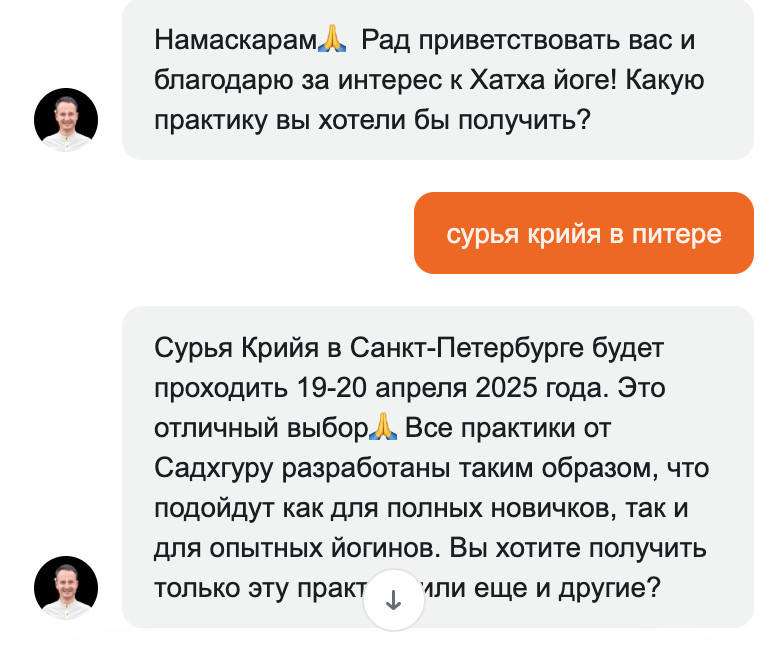
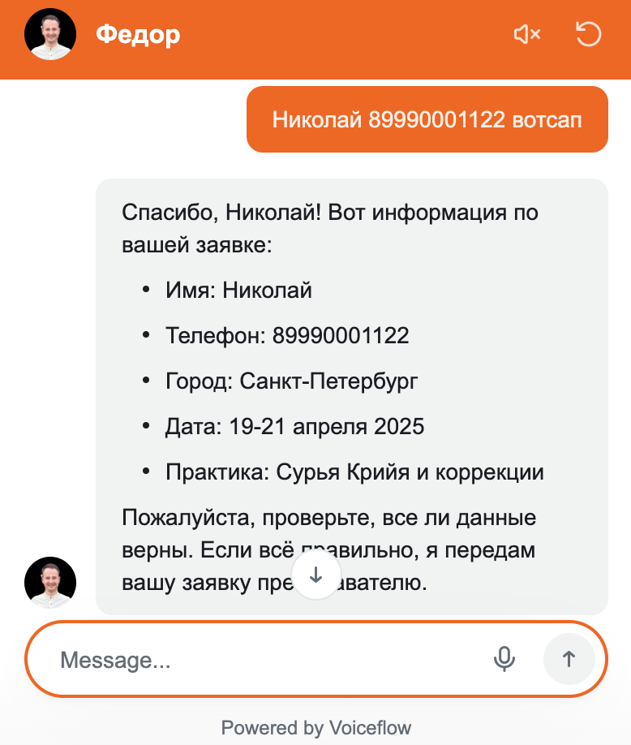
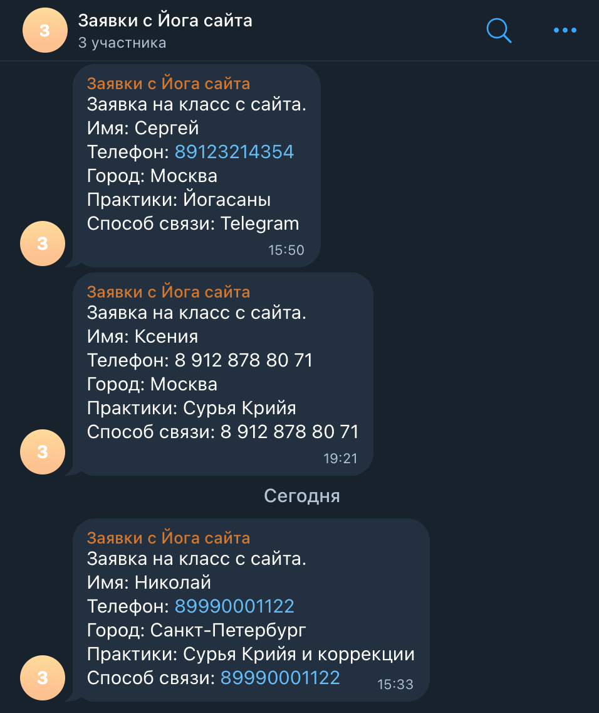
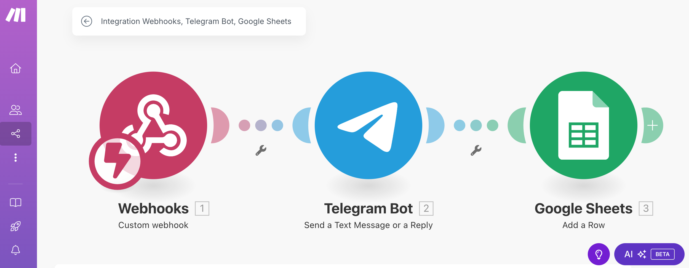
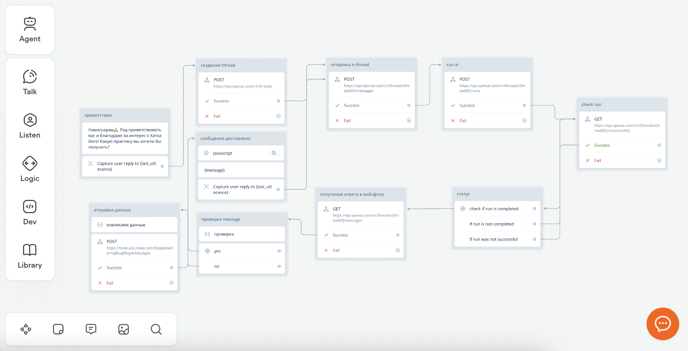

# 🛒 AI-консультант для сайта преподавателя йоги

**Этот проект демонстрирует интеграцию [посадочной страницы](https://yogasadhana.space/) с ИИ-консультантом на базе Telegram и ChatGPT.**  
Ассистент предназначен для автоматизации взаимодействия с клиентами, улучшения пользовательского опыта, сбора заявок и повышения конверсий.  
Проект охватывает весь процесс: от создания аккаунтов и генерации контента до тестирования функционала.

---

## 🤖 ИИ-консультант

- Отвечает на вопросы клиентов в реальном времени  
- Рекомендует услуги в наилучшей для пользователя локации   
- Поддерживает *дружественный* и *профессиональный* стиль общения  

---

## ✍️ Генерация контента

- Использование **ChatGPT** для:  
  - генерации ответов на FAQ 
  - формирование базы знаний

---

## 📦 Управление заявками

- Интеграция уведомлений о заявках 
- Отправка данных о заявках в Telegram Bot  

---

## 🔗 Интеграция платформ

| Инструмент        | Назначение                                          |
|-------------------|------------------------------------------------------|
| **Telegram**      | Отправка уведомлений через бота               |
| **ChatGPT**       | Обработка запросов и генерация контента             |
| **Make**          | Интеграция Telegram Bot с Google Sheets                         |
| **Voiceflow**     | Интеграция виджета на сайте с ChatGTP                    |
| **Tilda**         | Интеграция виджета ассистента с сайтом                  |

---

## 🛠️ Этапы реализации проекта

1. **Подготовка аккаунтов**  
   - Регистрация в Voiceflow  
   - Создание Telegram-бота через BotFather  
   - Настройка API-ключей OpenAI и интеграция

2. **Настройка ИИ-консультанта**  
   - Приветственные сообщения
   - Создание базы знаний  
   - Системный промпт с описанием услуг и фазами действий 
   - Интеграция с Voiceflow

3. **Настройка алгоритма сбора данных из заявки**  
   - Алгоритм сбора ключевых данных из дилога с клиентом
   - Отправка данных о заявке в Google Sheets и интеграция
   - Отправка заявок в Telegram Bot и интеграция  

4. **Тестирование**  
   - Проверка работы бота  
   - Тестовые заказы и уведомления  

---

## 🖼 Примеры интерфейса

### Пример диалога с ассистентом
- 

### Сбор данных о заявке
- 

### Уведомления о заявке в Telegram-боте
- 

### Интеграция в Make
- 

### Сценарий в Voiceflow
- 

---

**🚀 Проект разработан в рамках обучения в [Zerocoder.ru](https://zerocoder.ru/prompt-engineer-with-ai-course)**  
